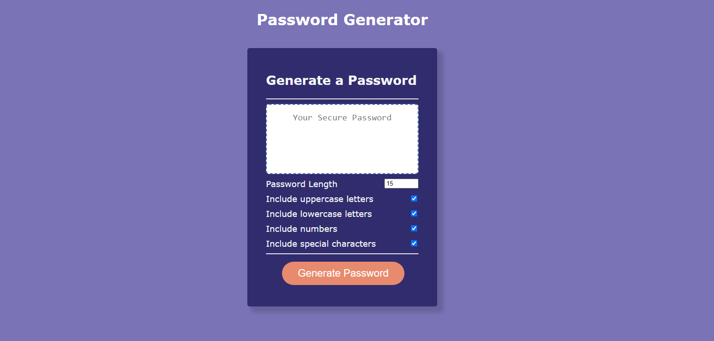

# password-generator

## Description

The purpose of this application is to assist in increasing security of user accounts by randomly generating a password based on certain neccessary criteria that meets the users needs.

## Usage

To use this web application, you can click into the box to the right of "Password length" to input the number of characters you desire for your new, random password. You can then click on each corresponding box to check and uncheck what criteria you would like to be utilized in your randomly generated password. If a number not between 8-128 characters is entered in the *Password length* section, the user will be prompted with the requirement to be between those two numbers. If the user does not check off any boxes for criteria, they will be prompted with an alert to select at least one of the criteria. 

### Link

[Link to deployed application](https://camparooni.github.io/password-generator/)

### References Used 

*  https://www.w3docs.com/snippets/javascript/how-to-get-the-value-of-text-input-field-using-javascript.html
*  https://stackoverflow.com/questions/39163561/how-to-alert-user-to-correct-input-fields-in-form-validation-using-javascript
* https://developer.mozilla.org/en-US/docs/Web/JavaScript/Reference/Operators/Logical_NOT
* https://developer.mozilla.org/en-US/docs/Web/JavaScript/Reference/Global_Objects/Math/random
